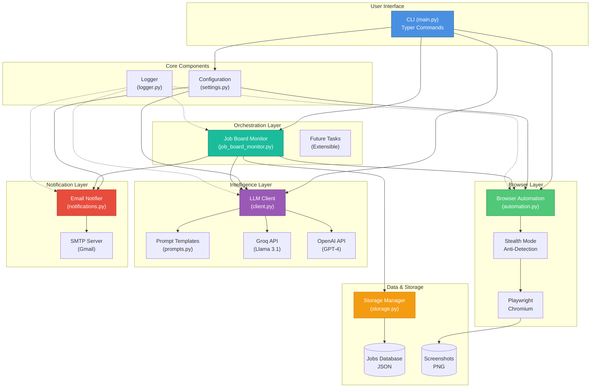
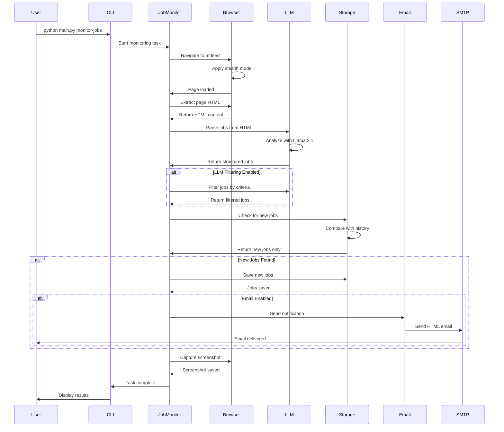

# 🤖 Intelligent Web Automation Agent

**An advanced, autonomous web agent designed to navigate the modern web with human-like intelligence.**

Built on **Playwright** and powered by **Llama 3 (via Groq)** or **OpenAI**, this agent goes beyond simple scraping. It understands page context, bypasses anti-bot measures with stealth technology, makes semantic decisions, and delivers actionable insights directly to your inbox. Whether monitoring job boards, tracking prices, or aggregating content, it handles the complexity so you don't have to.

## 🎬 Demo

Watch the agent in action as it navigates Indeed, extracts job listings, and prepares email notifications:


*The agent automatically navigates job boards, extracts listings using AI, and sends smart email alerts with direct application links.*

## ✨ Features

- **🌐 Browser Automation**: Powered by Playwright for reliable web interactions
- **🕵️ Stealth Mode**: Advanced anti-detection techniques to bypass bot blockers
- **🧠 LLM Integration**: Uses Groq (Llama 3.1) or OpenAI for intelligent decision-making
- **📊 Job Board Monitoring**: Automatically monitor Indeed for new job listings
- **📧 Smart Email Alerts**: HTML emails with direct "Apply via Email" or "Apply on Website" links
- **💾 Smart Storage**: Track seen jobs and maintain history
- **🎯 LLM-Powered Filtering**: Intelligent job filtering based on your criteria
- **📸 Screenshot Capture**: Automatic screenshots for debugging
- **🔄 Extensible Architecture**: Easy to add new automation tasks

## 🚀 Quick Start

### Installation

1. **Clone or navigate to the project directory**

2. **Install dependencies**:
```bash
# Option 1: Install from requirements.txt (recommended for conda environments)
pip install -r requirements.txt

# Option 2: Install the package in editable mode
pip install -e .
```

3. **Install Playwright browsers**:
```bash
playwright install chromium
```

4. **Configure environment**:
```bash
# Copy example env file
cp .env.example .env

# Edit .env and add your Groq API key
# GROQ_API_KEY=your_key_here
```

### Usage

#### Monitor Job Boards

```bash
# Run with default settings (from .env)
python main.py monitor-jobs

# Custom keywords and location
python main.py monitor-jobs --keywords "senior python developer" --location "San Francisco"

# With LLM filtering
python main.py monitor-jobs --filter "Remote positions with salary above $120k"

# Disable email notifications
python main.py monitor-jobs --no-email
```

#### Test Browser Automation

```bash
# Test with default URL
python main.py test-browser

# Test with custom URL in headed mode (visible browser)
python main.py test-browser --url "https://news.ycombinator.com" --headed
```

#### Test LLM Integration

```bash
# Test LLM with default prompt
python main.py test-llm

# Custom prompt
python main.py test-llm --prompt "Explain web scraping in simple terms"
```

#### Check Configuration

```bash
python main.py config-check
```

#### View Stored Jobs

```bash
# Show latest 10 jobs
python main.py show-jobs

# Show more jobs
python main.py show-jobs --limit 20
```

## 📁 Project Structure

```
intelligent-web-automation-agent/
├── config/
│   └── settings.py          # Configuration management
├── src/
│   ├── browser/
│   │   └── automation.py    # Playwright wrapper
│   ├── llm/
│   │   ├── client.py        # LLM client (Groq/OpenAI)
│   │   └── prompts.py       # Prompt templates
│   ├── orchestrator/
│   │   └── tasks/
│   │       └── job_board_monitor.py  # Indeed monitoring
│   └── utils/
│       ├── logger.py        # Logging utilities
│       ├── storage.py       # Data persistence
│       └── notifications.py # Email system
├── examples/
│   ├── job_monitor_demo.py  # Job monitoring example
│   └── simple_scrape.py     # Web scraping example
├── main.py                  # CLI application
├── .env                     # Environment configuration
└── pyproject.toml          # Dependencies

```

## ⚙️ Configuration

### 1. Environment Setup
Edit `.env` file to customize settings:

```bash
# LLM Configuration
GROQ_API_KEY=your_groq_api_key_here

# Email Configuration (REQUIRED for notifications)
EMAIL_ENABLED=true
SMTP_HOST=smtp.gmail.com
SMTP_PORT=587
SMTP_USER=your-email@gmail.com
SMTP_PASSWORD=your-app-password  # See "Gmail Setup" below
EMAIL_TO=recipient@example.com

# Browser Settings
BROWSER_HEADLESS=true
BROWSER_TIMEOUT=30000

# Job Search Defaults
JOB_SEARCH_KEYWORDS=python developer,software engineer
JOB_LOCATION=remote
JOB_MAX_RESULTS=20
```

### 2. Gmail Setup (Crucial!)
To send emails via Gmail, you **cannot** use your regular password. You must use an **App Password**.

1.  Go to [Google Account Security](https://myaccount.google.com/security).
2.  Enable **2-Step Verification** (if not already enabled).
3.  Search for **"App passwords"** (or find it under 2-Step Verification).
4.  Create a new App Password (name it "Web Agent").
5.  Copy the 16-character code (e.g., `abcd efgh ijkl mnop`).
6.  Paste this code into your `.env` file as `SMTP_PASSWORD`.

## 🎯 Example Use Cases

### 1. Job Board Automation
Monitor multiple job boards, extract listings, filter by criteria, and receive email summaries.

### 2. Price Monitoring
Track product prices across e-commerce sites and get alerts on price drops.

### 3. Content Aggregation
Collect articles, news, or updates from multiple sources and generate summaries.

### 4. Form Automation
Automatically fill and submit forms based on intelligent decision-making.

### 5. Data Extraction
Extract structured data from websites using LLM-powered parsing.

## 🧠 How It Works

1. **Browser Automation**: Playwright navigates to target websites
2. **Content Extraction**: HTML content is captured and cleaned
3. **LLM Analysis**: Groq/OpenAI analyzes content and extracts structured data
4. **Intelligent Filtering**: LLM filters results based on your criteria
5. **Storage**: New items are saved and tracked to avoid duplicates
6. **Notifications**: Email summaries are sent for new findings

## 🏗️ Architecture

### System Architecture



### Job Monitoring Workflow



## 🔧 Development

### Running Examples

```bash
# Job monitoring demo
python examples/job_monitor_demo.py

# Simple web scraping
python examples/simple_scrape.py
```

### Adding New Tasks

1. Create a new file in `src/orchestrator/tasks/`
2. Implement your automation logic using `BrowserAutomation` and `LLMClient`
3. Add a CLI command in `main.py`

## 📝 Notes

- **Groq API**: Fast and cost-effective, recommended for most use cases
- **Email Setup**: For Gmail, use an [App Password](https://support.google.com/accounts/answer/185833)
- **Headless Mode**: Set `BROWSER_HEADLESS=false` to watch the browser in action
- **Rate Limiting**: Be respectful of websites - add delays between requests

## ❓ Troubleshooting

### ModuleNotFoundError: No module named 'typer' (or others)
If you see this error, it means dependencies weren't installed correctly. Run:
```bash
pip install -e .
```

### SMTP Authentication Error (534)
This means you are using your regular Gmail password. You **must** use an App Password. See the **Gmail Setup** section above.

### "No jobs extracted"
- The website layout might have changed.
- The site might be blocking the bot. The agent uses Stealth Mode, but some blocks are very strict. Check `screenshots/` to see what the bot saw.

## 🤝 Contributing

This is a framework designed to be extended! Add your own automation tasks and share them.

## 📄 License

MIT License - feel free to use and modify for your projects.

---

**Built with**: Playwright • LangChain • Groq • Python

